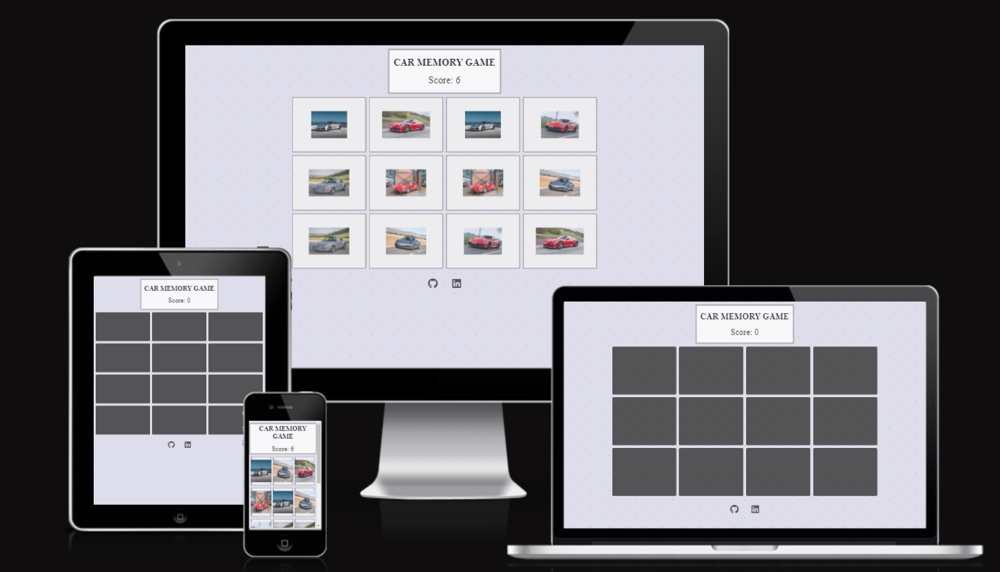
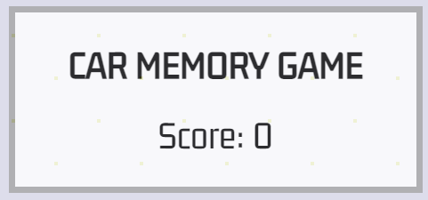
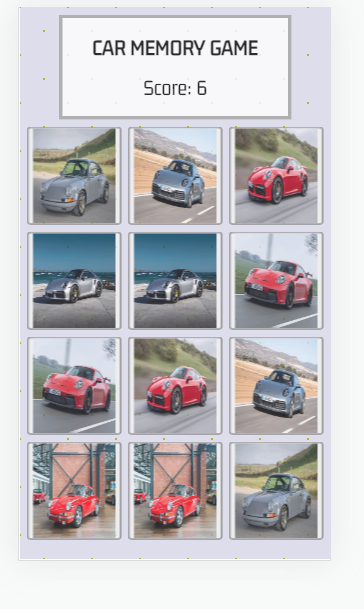
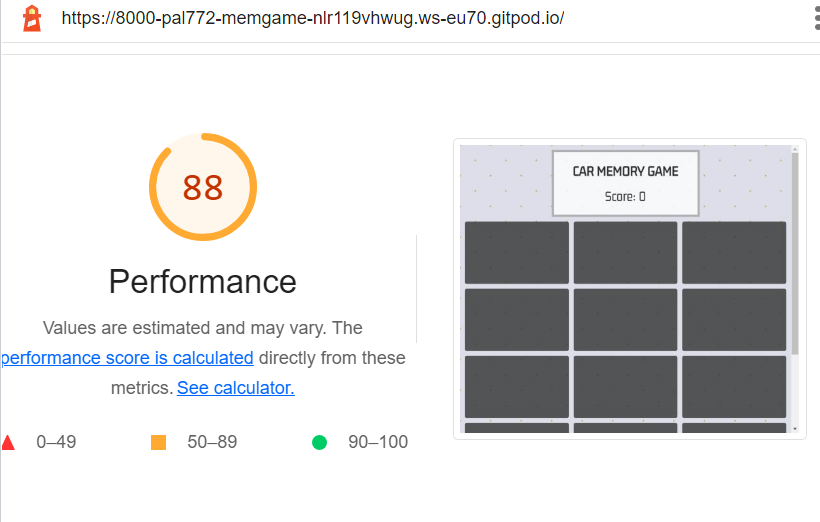
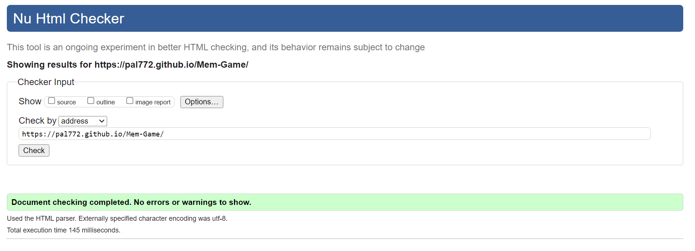
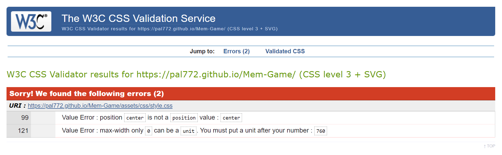
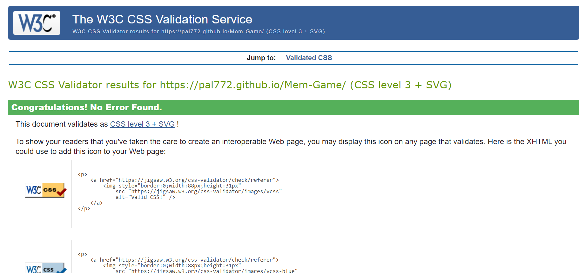
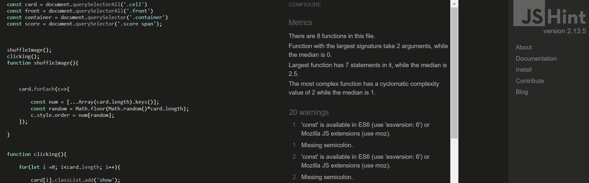
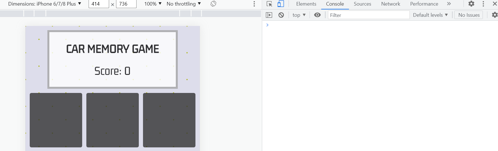

<h1 align="center">Car Memory Game - JavaScript</h1>

### Developer: Prithpal Phull

<b>[View live website here](https://pal772.github.io/Mem-Game/)</b> : computer:

This is a memory Game created as Portfolio Project #2 (JavaScript Essentials) for Diploma in Full Stack Software Development at [Code Institute](https://www.codeinstitute.net).   It is an interactive front-end game, where the user can test their memory. The application is easy to use for the user, it is responsive across a range of devices and incorporates best practices regarding design and accesibility. 

The project purpose is presentation of an interactive game. The site should respond to the users actions 
allowing a user to actively engage with visual images. 
  
 

# Table of content 

*   [Project](#project)
    *   [Strategy/Scope](#strategyscope)
    *   [Site owner goals](#site-owner-goals)
    *   [Site user goals](#user-goals)
*   [User Experience (UX/UI)](#user-experience-ux)
    *   [Colour Scheme](#colour-scheme)
    *   [Typography](#typography)
    *   [Structure](#structure)
*   [Technology](#technology)
    *   [Languages used](#languages-used)
    *   [Frameworks, libraries & software used](#languages-used)
    *   [Testing](#testing)
    *   [Performance](#performance)
    *   [Validation](#validation)
    *   [HTML](#html)
    *   [CSS](#css)
    *   [JavaScript](#javascript)
    *   [Bugs/known issues](#bugsknown-issues)
    *   [Browser compatibility](#browser-compatibility)
    *   [Platforms/devices](#platformsdevices)
    *   [Responsiveness](#responsiveness)
    *   [Peer review](#peer-review)
    *   [Deployment](#deployment)
    *   [Credits](#credits)
    *   [Code](#code)
    *   [Media](#media)
    *   [Acknowledgements](#acknowledgements)

#   Project
##  Strategy/Scope

This Car Memory Game is an entertainment app intended for anyone who wants to test their memory. Playing this memory game, the user will have to concentrate and focus.

 

 The content is presented on a single page that display's car images depending on the user action. The <b>Primary goal</b> Is to get the user's visual attention, for them to concentrate and focus. <b>The secondary objective</b> Is to entertain the user during the game. With this in mind the website's design provides visual images of cars. 

 To achieve the games intension, I implemented following features:

* Simple website layout with the content located in the centre.
* Easy to click buttons both on a computer and mobile touch interface.
* Kept the game plain and simple.
* Visual images to user actions.
* A score board, so user knows how many he/she have got right.

 

## Site owner goals

- To entertain and have an interactive experience for the user.
- Provide a link to linkedIn and GitHub projects repository, to interest the user in the project, 
  and to obtain new followers.
- To provide a website that looks well across a range of devices (responsiveness).  

##  User goals

- As a user I want to:
    - Keep the game as simple as possible.
    - See clean interface and be able to track score.
    - Get the user to us their memory.
    - Also have to concentrate on a visual level. 
    - Enjoy the game.
    - Follow the developer on social media.

#   User Experience (UX)

##  Colour Scheme

I used neutral colors for the background, so that its not too much of a distraction when the user is 
trying to concentrate on the on the game and trying to memorise where the matching images are.
I also choose only 2 different colour cars, so that the user has to concemtrate more.

 

##  Typography

-   The <b>Gemunu Libre</b> font is used for the main title and score, with sans-serif as a fallback. 
    The Gemunu Libre is a game looking font and looks great. It is sourced from 
    [Google fonts](https://fonts.google.com/specimen/Gemunu+Libre). 
    And it's linked to CSS document via @import.

 

##  Structure

The main page is designed in a very simple way and easy to use. So that the user understands straight 
away how to play the game.
It has 4 boxes along and 3 down, with a total of 12 hidden car images. 

#   Technology
    
##  Languages used

-   [HTML5](https://en.wikipedia.org/wiki/HTML5)
-   [CSS3](https://en.wikipedia.org/wiki/Cascading_Style_Sheets)
-   [JavaScript](https://en.wikipedia.org/wiki/JavaScript)
-   [Markdown](https://en.wikipedia.org/wiki/Markdown)  
    Markup language used to write this document.
    
##  Frameworks, libraries & software used

- [Google Fonts](https://fonts.google.com/specimen/Gemunu+Libre) - Google fonts were used to import the 'Gemunu+Libre' font into the style.css file, which is used on the main title and score on this project.

- [Git](https://git-scm.com/) - Git was used for version control by utilizing the Gitpod terminal to commit to Git and Push to GitHub.

- [GitHub](https://github.com/) - GitHub is used to store the project's code after being pushed from Git.

- [GitPod](https://www.gitpod.io) - Used to code the project.

- [Yahoo images](https://uk.images.search.yahoo.com/search/images/porsche;) - Yahoo was used to sourse the images for this game.

- [Am I Responsive](https://ui.dev/amiresponsive) - Online tool used to create mockup to present responsive design of this project.

- [Lighthouse](https://developers.google.com/web) - Google WebDev tool used for performance/accesibility testing.  

- [Favicon.io](https://www.favicon.io) - Tool used to create favicon.

##   Performance

 [Lighthouse](https://developers.google.com/web) - Google webdev tool used for performance testing showing just below maximum score.

## Validation

### HTML

- [W3C Markup Validator](https://validator.w3.org/nu/) - validation service used.

Result for HTML Checker

### CSS

- [W3C CSS Validator](https://jigsaw.w3.org/css-validator/#validate_by_input)  - validation service used.

- First Test The first error on line 99, was not needed. so i ended upp deleting it
The second error on line 121, i forgot to put 'px' after the value. so i ended up 
changing it to 300px. And that worked perfect.

- No errors found on the second test.

### JavaScript 

- [JS Hint](https://jshint.com/) - validation service used.

- Found 20 errors in my javascript test. Which obviously need sorting out.

- Application was tested manually for bugs and errors during throught development process. All console.log messages have been removed before app release.

##   Browser compatibility

Website was tested manually on following browsers: Google Chrome, Firefox, Safari. The results were satisfactory on all browsers. 

##   Platforms/devices

Website was tested manually on Apple Iphone X, Apple iphone 6/7/8 plus, Apple iPad, Apple Macbook Air, Samsung galaxy A51/71. The results were satisfactory and proved to be good responsiveness on all screen sizes.

## Responsiveness

I confirmed that this website is responsive and all the functions are displayed correctly.

