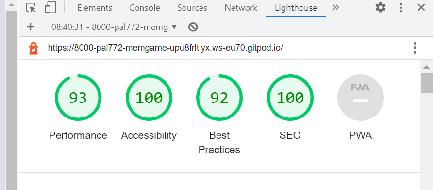
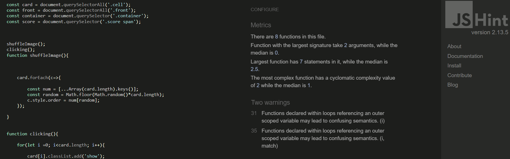
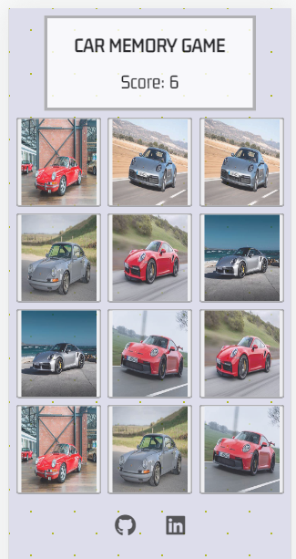
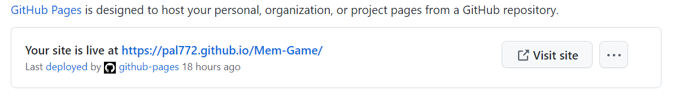

<h1 align="center">Car Memory Game - JavaScript</h1>

### Developer: Prithpal Phull

<b>[View live website here](https://pal772.github.io/Mem-Game/)</b> : computer:

This is a memory Game created as Portfolio Project #2 (JavaScript Essentials) for Diploma in Full Stack Software Development at [Code Institute](https://www.codeinstitute.net).   It is an interactive front-end game, where the user can test their memory. The application is easy to use for the user, it is responsive across a range of devices and incorporates best practices regarding design and accesibility. 

The project purpose is presentation of an interactive game. The site should respond to the users actions 
allowing a user to actively engage with visual images. 
  
 

# Table of content 

*   [Project](#project)
    *   [Strategy/Scope](#strategyscope)
    *   [Site owner goals](#site-owner-goals)
    *   [Site user goals](#user-goals)
    *   [Features](#features)
*   [User Experience (UX/UI)](#user-experience-ux)
    *   [Colour Scheme](#colour-scheme)
    *   [Typography](#typography)
    *   [Structure](#structure)
*   [Technology](#technology)
    *   [Languages used](#languages-used)
    *   [Frameworks, libraries & software used](#languages-used)
    *   [Testing](#testing)
    *   [Lighthouse](#lighthouse)
    *   [Validation](#validation)
    *   [HTML](#html)
    *   [CSS](#css)
    *   [JavaScript](#javascript)
    *   [Bugs/known issues](#bugsknown-issues)
    *   [Browser compatibility](#browser-compatibility)
    *   [Platforms/devices](#platformsdevices)
    *   [Responsiveness](#responsiveness)
    *   [Peer review](#peer-review)
    *   [Deployment](#deployment)
    *   [Credits](#credits)
    *   [Code](#code)
    *   [Media](#media)
    *   [Learning-Resorces](#learning-resources)
    *   [Acknowledgements](#acknowledgements)

#   Project
##  Strategy/Scope

This Car Memory Game is an entertainment app intended for anyone who wants to test their memory. Playing this memory game, the user will have to concentrate and focus.

 

 The content is presented on a single page that display's car images depending on the user's action. The <b>Primary goal</b> is to get the user's visual attention, for them to concentrate and focus. The<b> secondary objective</b> is to entertain the user during the game. With this in mind the website's design provides visual images of cars. 

 To achieve the games intension, I implemented following features:

* Simple website layout with the content located in the centre.
* Easy to click buttons both on a computer and mobile touch interface.
* Kept the game plain and simple.
* Visual images to user actions.
* A score board, so user knows how many he/she have got right.

 

## Site owner goals

- To entertain and have an interactive experience for the user.
- Provide a link to linkedIn and GitHub projects repository, to interest the user in the project, 
  and to obtain new followers.
- To provide a website that looks well across a range of devices (responsiveness).  

##  User goals

- As a user I want to:
    - Keep the game as simple as possible.
    - See clean interface and be able to track score.
    - Get the user to us their memory.
    - Also have to concentrate on a visual level. 
    - Enjoy the game.
    - Follow the developer on social media.

## Features

  - Has a main title at the top of the page.
  - Underneath the title is the score.
  - There are 12 boxes, and in each box has an image of 6 diffrent cars.
  - You have to click on a box at a time to reveal an image. 
  - Only 2 boxes can be clicked at a time, to reveal an image.
  - If wrong, they will flip back over and disappear.
  - 2 images are the same, which need to be paired up to score a point.
  - The images are of cars, which i'm a big fan of.
  - The cars are only silver or red, which makes the game a bit more difficult. 
  - The user needs to concentrate to pair up all the same cars to complete the game.
  - There are two links at the bottom of the page, my github and LinkedIn page.

#   User Experience (UX)

##  Colour Scheme

I used neutral colors for the background, so that its not too much of a distraction when the user is 
trying to concentrate on the on the game and trying to memorise where the matching images are.
I also choose only 2 different colour cars, so that the user has to concemtrate more.

 

##  Typography

-   The <b>Gemunu Libre</b> font is used for the main title and score, with sans-serif as a fallback. 
    The Gemunu Libre is a game looking font and looks great. It is sourced from 
    [Google fonts](https://fonts.google.com/specimen/Gemunu+Libre). 
    And it's linked to CSS document via @import.

 

##  Structure

The main page is designed in a very simple way and easy to use. So the user understands straight 
away how to play the game. It has 12 boxes in total, with 6 diffrent car images, 2 two images 
the same which needs to be pair up.

#   Technology
    
##  Languages used

-   [HTML5](https://en.wikipedia.org/wiki/HTML5)
-   [CSS](https://en.wikipedia.org/wiki/Cascading_Style_Sheets)
-   [JavaScript](https://en.wikipedia.org/wiki/JavaScript)
    
##  Frameworks, libraries & software used

- [Google Fonts](https://fonts.google.com/specimen/Gemunu+Libre) - Google fonts were used to import the 'Gemunu+Libre' font into the style.css file, which is used on the main title and score on this project.

- [Git](https://git-scm.com/) - Git was used for version control by utilizing the Gitpod terminal to commit to Git and Push to GitHub.

- [GitHub](https://github.com/) - GitHub is used to store the project's code after being pushed from Git.

- [GitPod](https://www.gitpod.io) - Used to code the project.

- [Yahoo images](https://uk.images.search.yahoo.com/search/images/porsche) - Yahoo was used to source the images for this project.

- [Am I Responsive](https://ui.dev/amiresponsive) - Online tool used to create mockup to present responsive design of this project.

- [Lighthouse](https://developers.google.com/web) - Google WebDev tool used for performance/accesibility testing.  

- [Favicon.io](https://www.favicon.io) - Used favicon. I choose a thinking bubble image for my URL/website icon.

## Lighthouse

 [Lighthouse](https://developers.google.com/web) - Used Google DevTools to check on the 
 games performance, accessibility, best practices and SEO.

## Validation

### HTML

- [W3C Markup Validator](https://validator.w3.org/nu/) - validation service used.

Result for HTML Checker

### CSS

- [W3C CSS Validator](https://jigsaw.w3.org/css-validator/#validate_by_input)  - validation service used.

### JavaScript 

- [JS Hint](https://jshint.com/) - validation service used.

- Final test, had 2 warnings.
  I'll look into that, with more detail and get that fixed in the future. 

##   Bugs/known issues

### HTML

There were no bugs found when i put it through the HTML checker.

### CSS

- First Test The first error on line 99, was fixed by deleting the line completly.
The second error on line 121, i forgot to put 'px' after the value. So changed 
the value to 300 and also added the px, which worked perfect.

- Application was tested manually for bugs and errors during throught development process. All console.log messages have been removed before app release.

### Java script

- Found 20 warnings when testing javaScript code.
- Some were simple, missing semicolons.
- Ended up with 2 warnings -  "Function declared within loops referencing an outer scoped variable
may lead to confusing semantics".  I'll look into that with more detail in the future.

### Lighthouse

- For future reference - Performance can be improved by image size and render-blocking.
- For future reference - Best practices, improve on displaying images with correct aspect ratio.

##   Browser compatibility

Website was tested manually on following browsers: Google Chrome, Firefox, Safari. The results were satisfactory on all browsers. 

##   Platforms/devices

Website was tested manually on Apple Iphone X, Apple iphone 6/7/8 plus, Apple iPad, Apple Macbook Air, Samsung galaxy A51/71. The results were satisfactory and proved to be good responsiveness on all screen sizes.

## Responsiveness

I confirmed that this website is responsive and all the functions are displayed correctly.

## Peer review

I asked my friends and coleagues to test the application and I received a lot of positive feedback, no major 
issues were reported.
For future reference need to improve image quality and size. And add levels and a timer.

#   Deployment

The project was deployed to GitHub Pages using the following steps:  

1. Log in to GitHub and locate the [mem-game](https://github.com/pal772/Mem-Game) repository. 
2. Locate the "Settings" Button on the menu.
3. Scroll down the Settings page until you locate the "Pages" in "Code and automation" section.
4. Under "Source", click the dropdown called "Select branch:" and select "Main", click the dropdown called "Select folder" and select "/root".
5. The page will automatically refresh and you receive message "Your site is published at https://pal772.github.io/Mem-Game/". Result below: 

 

#   Credits

## Code

- Mentor - Sammy Dartnall helped me fix warnings on my JavaScript testing.
(use 'esversion: 6') or Mozilla JS extensions. Got fixed by clicking on "configure" and scroll down to the bottom of the page and selecting "Mozilla JavaScript extentions".

## Media

Content

- [Yahoo images](https://uk.images.search.yahoo.com/search/images/porsche) - All images sourced from Yahoo.
- [Favicon.io](https://www.favicon.io) - Used favicon to choose my URL/website icon.
- [font awesome](https://fontawesome.com/) - Icons used on the footer.
- [google fonts](https://fonts.google.com/) - Fonts used on this project.
- [am i responsive](https://ui.dev/amiresponsive) - Main image used on Preview README.md

## Learning resources

- [Code Institute course and learning platform](https://codeinstitute.net/)
- [W3Schools](https://www.w3schools.com/js/default.asp)
- [Youtube](https://www.youtube.com/)

##  Acknowledgements

- My Mentor Sammy Dartnell for helpful feedback and guidance on stages of the project. 
- Code Institute Slack Community for being a great knowledge base.

